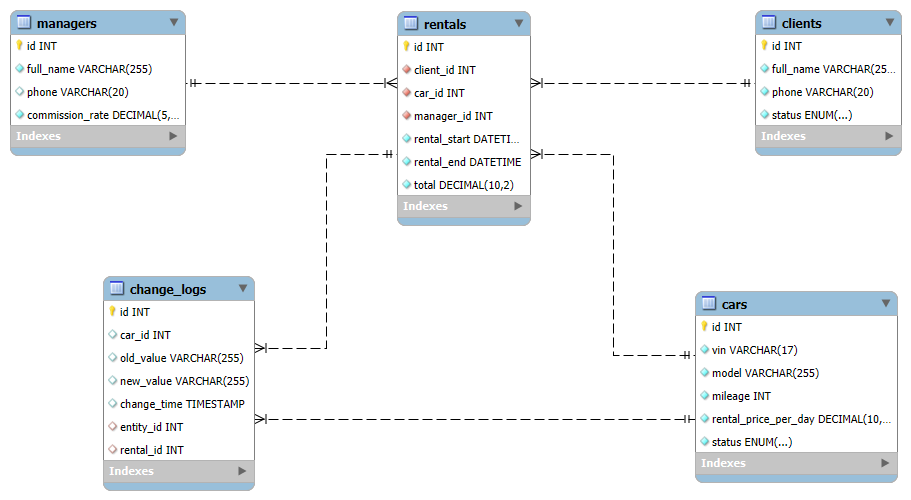

# База данных для аренды автомобилей.


>[!TIP]
+ [Типовые запросы](#Типовые-запросы)
* [Хранимые процедуры](#Хранимые-процедуры)
+ [Триггер для хранимой процедуры](#Триггер-для-хранимой-процедуры)

> [!IMPORTANT]
> ## Для разворачивания БД и тестовых данных необходимо скачать и инициализировать файл dump.sql

> [!IMPORTANT]
> ## Типовые запросы:

### Отображает все автомобили, которые можно арендовать прямо сейчас:

```sql
SELECT id, model, mileage, rental_price_per_day
FROM cars
WHERE status = 'available';
```

### Показывает, какие машины арендовал клиент, с датами и итоговой суммой:

```sql
SELECT r.id AS rental_id, c.model, r.rental_start, r.rental_end, r.total
FROM rentals r
JOIN cars c ON r.car_id = c.id
WHERE r.client_id = 1;
```

### Расчет общей выручки за период
```sql
SELECT SUM(total) AS total_income
FROM rentals
WHERE rental_start >= '2025-06-01' AND rental_start <= '2025-06-30';
```

### Выдача аренд, оформленных конкретным менеджером

```sql
SELECT m.full_name, COUNT(*) AS rentals_count, SUM(r.total) AS total_earned
FROM rentals r
JOIN managers m ON r.manager_id = m.id
GROUP BY r.manager_id;

```

### Список автомобилей, находящихся в ремонте

```sql
SELECT id, model, mileage
FROM cars
WHERE status = 'maintenance';

```


### Данное представление объединяет данные из различных таблиц, предоставляет комплексную информацию:

```sql
SELECT * FROM car_rental_db.rental_summary_view;
```

> [!IMPORTANT]
> ## Хранимые процедуры: 

### Данная хранимая процедура содержит: 
- Обработчик исключений 
+ Условие

```sql
call car_rental_db.blacklist(7);
```

### Данная хранимая процедура содержит: 
- Обработчик исключений
* Транзакцию 
+ Условие

```sql
call car_rental_db.rent_car(4, 7, 1, '2025-06-24', '2025-06-28'); -- Пример аренды автомобиля, клиент(id=4) арендовал автомобиль (id=7), воспользовался услгами менеджера(id=1) 
```

### Данная хранимая процедура содержит: 
- Обработчик исключений
* Транзакцию 
+ Условие

```sql
call car_rental_db.return_car(7, '2025-06-25', 31900); -- Пример врзврата арендованого автомобиля. Проверяет аренду(id), дата возврата автомобиля, пробег автомобиля при возврате.
```

> [!IMPORTANT]
> ## Триггер для хранимой процедуры:

```sql
AFTER UPDATE ON cars
FOR EACH ROW
BEGIN
    IF OLD.status != NEW.status AND NEW.status = 'maintenance' THEN
        INSERT INTO change_logs (entity_id, old_value, new_value)
        VALUES (NEW.id, OLD.status, 'maintenance');
    END IF;
END
```
# bd
